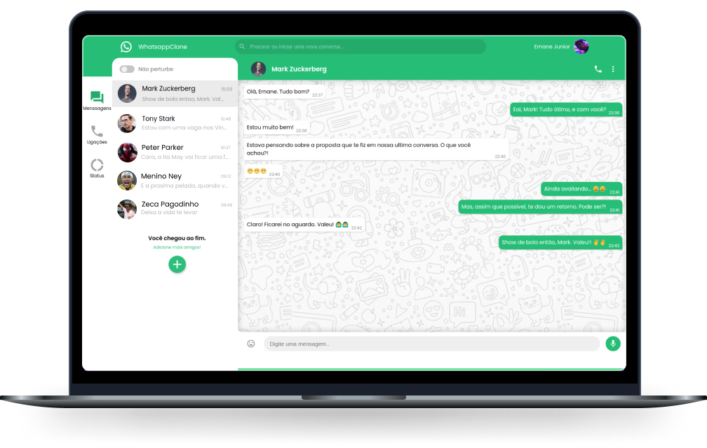

<h1 align="center">
  <strong>Whatsapp Clone  </strong>
</h1>

<div align="center">
  <a href="#-Tecnologias">Tecnologias</a>&nbsp;&nbsp;&nbsp;|&nbsp;&nbsp;&nbsp;
  <a href="#-Projeto">Projeto</a>&nbsp;&nbsp;&nbsp;|&nbsp;&nbsp;&nbsp;
  <a href="#-Use">Use</a>&nbsp;&nbsp;&nbsp;
</div>

<br>

<p align="center">
  <p align="center">
  
</p>

</p>

## 🚀 Tecnologias

Esta aplicação foi desenvolvida com as seguintes tecnologias:

- HTML 5
- CSS 3
- JavaScript
- React
- Firebase

## 💻 Projeto
<p>
Esta aplicação tem como intuito fortificar os conhecimentos adquiridos ao longo do estudo de `ReactJs`. A mesma conta com sistema de mensagens em tempo real e possibilidade de escrita por transcricao via áudio. Os métodos de logins se dão por três tipos:

- Facebook
- Google
- Github

Facilitando assim, o acesso pelo usuario.

O projeto teve como finalidade o clone idêntico ao aplicativo de mensagens whatsapp em sua interface atual. Porem, para ir um pouco além, foi implementado um possível redesign da aplicação como um todo.
</p>

## 💡 Use
### ✔ Acesse
<a target="_blank" href="https://clone-whatsapp.netlify.app/">Clique aqui</a> para acessar a aplicação.

### ✔ Rode em sua máquina

- Clone este repositorio:

```bash
$ git clone https://github.com/ErnaneJ/WhatsappClone.git
```

- Instale todas as dependências:

```bash
$ npm install
```
- Inicie a aplicação:

```bash
$ npm start
```

##### * Se voce desejar implementar ou melhorar alguma feature fique avontade para enviar uma solicitacao de pull. Irei adorar receber!.
---

<div align="center">
Desenvolvido com ❤ por <a target="_blank" href="https://ernane-dev.netlify.app/">Ernane Ferreira</a>. 👋🏻<br/>
<small>Interface baseada na <a href="https://themeui.net/whatsapp-redesign-free-ui-kit-for-figma/">Whatsapp redesign UI KIT</a> desenvolvido por <a href="https://dribbble.com/2muchcoffee">2muchcoffee</a>.<small>
</div>
